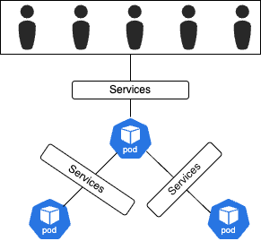
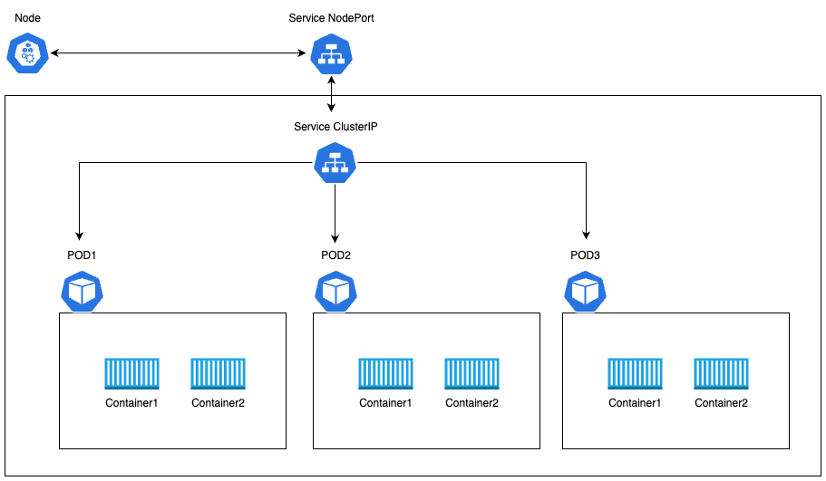
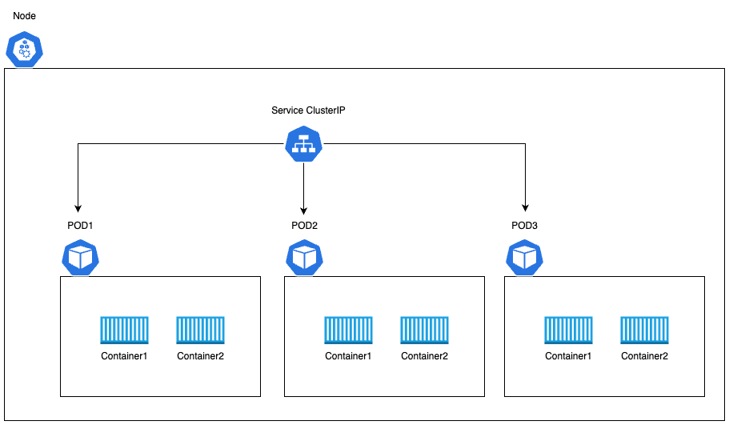
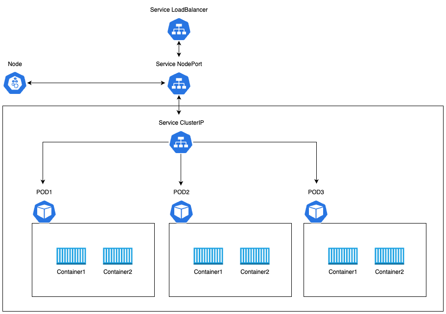

# networking

Kubernetes 内の各ポッドには、IP アドレスが割り当てられる。

# Services

アプリケーション同士の接続を支援

|  |
| :------------------------------: |

NordPort, ClusterIP, LoadBalancer などの種類が存在する。

# NortPort

ノード上のポッドにアクセスするためのサービス

|  |
| :--------------------------------: |

# ClusterIP

クラスタ内に仮装 IP を作成し、各ポッドの通信を可能にするためのサービス

|  |
| :----------------------------------: |

# LoadBalancer

負荷を分散するためのサービス

|  |
| :----------------------------------------: |
